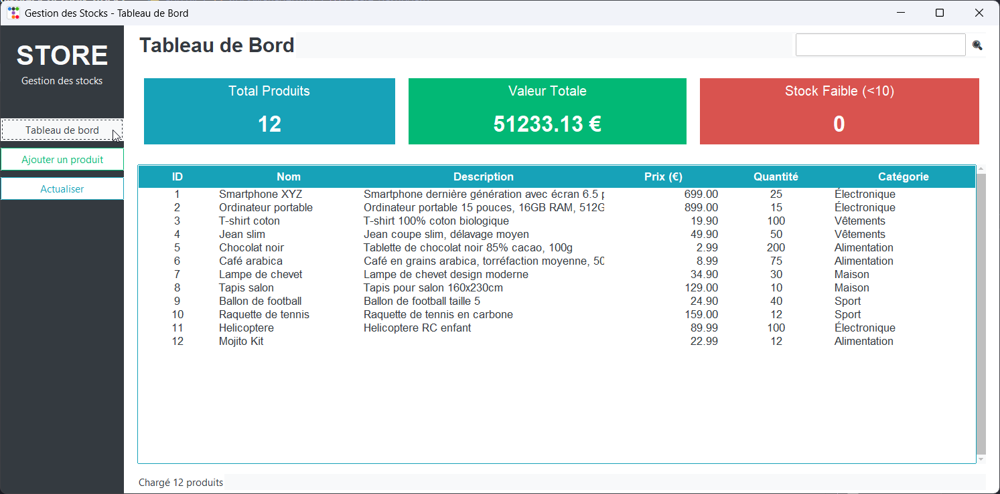
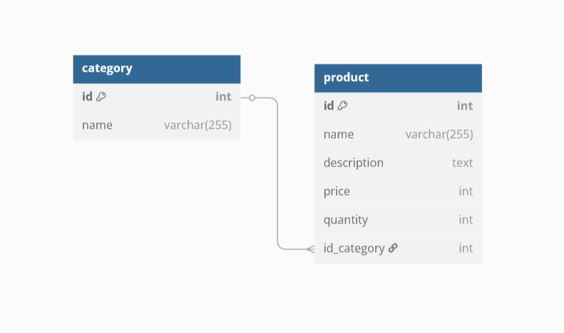

# Gestion des Stocks (Stock Management) - Python & MySQL

This Python project provides a simple stock management system ("gestion des stocks" in French) using a MySQL database. It allows users to add, remove, and manage products and categories within the database.

## Screenshot

 
 

## Features

*   **Add Products:** Add new products to the database, including details like name, description, price, quantity in stock, and category.
*   **Remove Products:** Delete existing products from the database.
*   **Update Products:** Modify the details of existing products (e.g., update quantity, price, description).
*   **Add Categories:** Create new product categories.
*   **Remove Categories:** Delete existing categories (consider how this impacts products in that category – do you cascade delete, set to a default category, or prevent deletion if products exist?).
*   **View Products:** Display a list of all products, optionally filtered by category.
*   **View Categories:**  Display a list of all categories.
*   **Search Products (Optional):** If you have a search feature, mention it here.
* **Database Connection Management:** Handles the connection to the MySQL database.

## Future Improvements 

*   Implement user authentication.
*   Improve error handling and provide user-friendly messages.
*   Implement reporting features (e.g., generate reports on stock levels).
*   Create a more visually appealing user interface.
*   Add unit tests.

## License

This project is licensed under the [MIT License](LICENSE) - see the LICENSE file for details. (Create a LICENSE file).

## Acknowledgements

*   MySQL Connector/Python
*   python-dotenv (to handle environment variables such as DB password)
